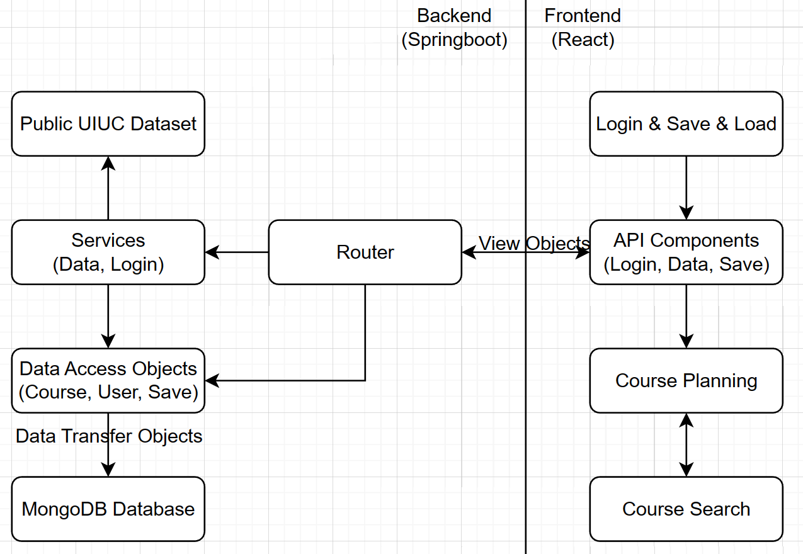

# iPlanner

## What is iPlanner?

A 4-year planning webapp for UIUC students that automatically informs users of credit count, missing prerequisites or corequisites, all in an intuitive graphical interface. \Wohoo/

## Team Members & Role

- Jizheng (Daniel) He: Coordinator and architect; frontend development.
- Anant Matta: Frontend development.
- Encheng (Kevin) Xie: Backend development/data processing.
- Zihao (Edward) Huang: Backend development/server routing & database management.

## Technical Architecture & File system



- `backend`: Springboot-based backend.
  - `config`: Configures CORS policy for development environment.
  - `controller`: Routers that handle frontend requests.
  - `dao`: Data Access Objects that interact with the MongoDB database.
  - `model`: Data Transfer Objects, datatypes of "documents" in each table.
  - `service`: Service classes for data processing/downloading/saving and user authentication.
  - `vo`: View Objects used for frontend-backend communications.
- `frontend`: React-based frontend.
  - `App.tsx`: Main entry.
  - `components/PlanTable.tsx`: 4-year + proficiency planning table that supports dragging/dropping.
  - `components/SearchBar.tsx`: Responsive course searching based on subject/number/title.
  - `components/LoginForm.tsx`: Login/save/load user plans.
  - `utils/CardActions.tsx`: Reducer-based card actions for all `components/CourseCard` UI properties.

## Backend Dev Environment Setup

1. Download and install [JDK 17 Installer](https://www.oracle.com/java/technologies/javase/jdk17-archive-downloads.html).
2. Install Maven:
* If Windows, install Chocolatey:
  ```ps
  Set-ExecutionPolicy AllSigned
  Set-ExecutionPolicy Bypass -Scope Process -Force; [System.Net.ServicePointManager]::SecurityProtocol = [System.Net.ServicePointManager]::SecurityProtocol -bor 3072; iex ((New-Object System.Net.WebClient).DownloadString('https://community.chocolatey.org/install.ps1'))
  ```
  Then install Maven by:
  ```ps
  choco install maven
  ```
* If MacOS/Linux, install homebrew:
  ```sh
  /bin/bash -c "$(curl -fsSL https://raw.githubusercontent.com/Homebrew/install/HEAD/install.sh)"
  ```
  Then install Maven by:
  ```sh
  brew install maven
  ```

3. In VSCode, install extensions "Extension Pack for Java" and "Spring Boot Extension Pack."
4. Set VSCode settings "Java > Jdt > Ls > Java: Home" to your java executable's directory.
* For Windows, the directoy will be something like `c:\\Program Files\\Java\\jdk-17`, **make sure to use escaped backslash characters!**.
* For MacOS, get the directory by running `/usr/libexec/java_home -v 17` in your terminal.
5. **While you are in the main Java file `IplannerApplication.java`**, click `F5` to run.

## Frontend Dev Environment Setup

1. Install [Node.js](https://nodejs.org/en/download/).
2. Install `yarn` via `npm`:
   ```sh
   npm install --global yarn
   ```
3. Start the frontend server:
   ```sh
   cd frontend/
   yarn install
   yarn start
   ```
4. Make sure it runs on port `3000`, or it will fail the CORS policy of the backend configuration.

## Database Setup

**Read all instructions before you start.**

### MongoDB Installation

1. Go to [MongoDB's official website](https://www.mongodb.com/try/download/community), select "Version 6.0.4 (current)", and download the MongoDB installer.
2. Keep everything as default in the installer.
3. Open MongoDB Compass (a GUI tool similar to MySQL workbench). Connect to `localhost:27017` (this should be the default connection).
4. If all is good you should see the database. Create a database named `iplanner` and a collection named `courses`.

### Springboot JPA Configuration

1. Create `application-dev.properties` in directory `backend/src/main/resources` (i.e. the same directory as `application.properties`). This file is `.gitignore`'d from the project and contains local development environment information.
2. Copy-paste the following configuration into the newly created file:
   ```
   spring.data.mongodb.uri = mongodb://localhost:27017/iplanner
   spring.data.mongodb.database = iplanner
   ```
3. In VSCode, reload your Java Project by "View > Command Palette" (in Windows `Ctrl+Shift+P`), search for "Java > Clean Java Language Server Workspace", hit Enter, and click "Reload and Delete" on the bottom-right pop-up.

### Load in course dataset

1. Access `http://localhost:1123/api/course/load-data` and wait for magic to happen! This takes around 2 minutes since there are ~9.2k courses in total.

